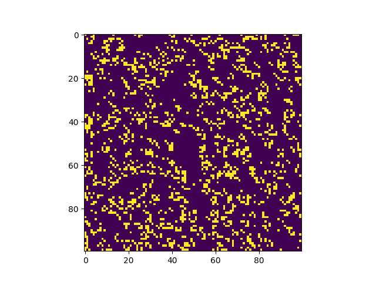

The Game of Life is an example of a cellular automaton, a collection of colored cells on a
grid that evolve through a number of time steps according to a set of rules
defining the states of neighboring cells.

This simulation consists of the following components:
- A property defined in one- or two-dimensional space
- A mathematical rule to change this property for each step in the simulation 
- A way to display or capture the state of the system as it evolves

Conway’s Game of Life has four rules.
1. If a cell is ON and has fewer than two neighbors that are ON, it turns OFF.
2. If a cell is ON and has either two or three neighbors that are ON, it remains ON.
3. If a cell is ON and has more than three neighbors that are ON, it turns OFF.
4. If a cell is OFF and has exactly three neighbors that are ON, it turns ON.

**Usage** 

1. `git clone https://github.com/the-inevitable/game-of-life.git`
2. `cd game-of-life`
3. `pip install -r requirements.txt`
4. `python gameoflife.py`

**Options**

`gameoflife.py [-h] [--grid-size N] [--mov-file MOVFILE] [--interval INTERVAL] [--glider]`

Run `python gameoflife.py -h` for more info.

The script is written in Python3.8.

